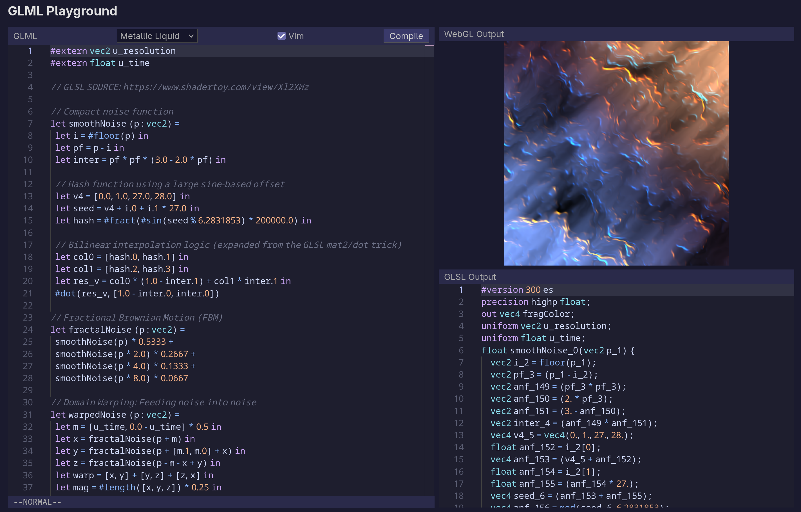

# Introduction

GLML (OpenGL Meta Language) is a functional DSL that compiles to GLSL fragment shaders. It brings ML-style programming to GPU shaders with HM-style type inference, first-class functions, algebraic data types, and pattern matching.

Try it now in the browser: [glml-lang.com](https://www.glml-lang.com)



## What GLML Gives You

- **Type inference**: No need to annotate every variable.
- **First-class functions**: Pass functions as values, build helpers that compose.
- **Algebraic data types**: Define `type shape = | Circle of float | Rect of float * float` and `match` on it.
- **Purity**: Every GLML program is a pure function from `vec2` (screen coordinate) to `vec3` (RGB color). No side effects, no mutation.
- **Recursion**: Write recursive shaders; the compiler compiles them to bounded while loops (capped at 1000 iterations, since GLSL doesn't support recursion).

## Example: Mandelbrot Shader in GLML

```glml
#extern vec2 u_resolution
#extern float u_time

// Normalizes coordinates to [-1, 1] and handles aspect ratio
let get_uv coord =
  let top = 2.0 * coord - u_resolution in
  let bot = #min(u_resolution.0, u_resolution.1) in
  top / bot

// Recursive Mandelbrot function
// zx, zy: Current state
// cx, cy: Constant location
let rec mandel zx zy cx cy i =
  if #length([zx, zy]) > 2. || i > 150. then
    i
  else
    let next_zx = zx * zx - zy * zy + cx in
    let next_zy = 2.0 * zx * zy + cy in
    mandel next_zx next_zy cx cy (i + 1.)

let main (coord : vec2) =
  let uv = get_uv coord in

  // Coordinates for the Seahorse Valley, zooming in and out
  let zoom = #exp(#sin(u_time * 0.4) * 4.5 + 3.5) in
  let cx = -0.7453 + uv.0 / zoom in
  let cy = 0.1127 + uv.1 / zoom in

  // Mandelbrot starting at <0., 0.>
  let iter = mandel 0.0 0.0 cx cy 0.0 in

  if iter > 149.0 then
    [ 0.0, 0.0, 0.0 ]
  else
    let n = iter / 150.0 in
    #sin(n * [10.0, 20.0, 30.0] + u_time) * 0.5 + 0.5
```
## Program Structure

Every GLML program must define a `main` function with the signature `main : vec2 -> vec3`, a pure function from pixel coordinates on the fragment to the RGB color for that pixel.

External uniforms from the host application are declared with `#extern`:

```glml
#extern vec2 u_resolution
#extern float u_time
```
